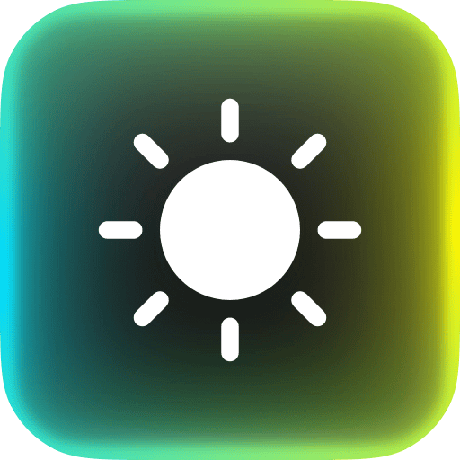

<p align="center">
  
</p>

# macEvnia

macEvnia is a native macOS menu bar app for Philips Evnia Ambiglow monitors that expose their backlight as a USB HID LampArray device.

It samples the screen, calculates LED colors, and sends them to the monitor in real time.

## Demo

<video src="demo.mp4" controls autoplay muted loop playsinline width="100%"></video>

[Watch the demo video](demo.mp4)

The default Philips `Follow Video` mode can produce visible LED brightness jumps and uneven backlight transitions.

macEvnia gives the host full control over the Ambiglow LEDs, with up to 50 Hz LED updates, smoothing, wall color compensation, and per-LED brightness calibration.

## Supported Monitor

Tested with:

- Philips Evnia 27M2N5901A / 27M2N5900A
- USB HID LampArray device: `0cf2:b215`

Other Philips Evnia models may work if they expose a compatible HID LampArray device.

## Features

- Menu bar control
- Screen-follow Ambiglow
- Profiles
- Capture rate from 1 FPS to 50 FPS
- LED update rate from 1 Hz to 50 Hz
- Screenshot quality control
- Ambiglow brightness
- Screen brightness
- Smoothing
- Sample radius
- Wall color compensation
- Per-LED brightness calibration
- Rainbow, solid color, lights off, and return to monitor defaults

## Privacy

macEvnia needs macOS Screen Recording permission because screen-follow Ambiglow works by sampling the screen.

While macEvnia is running in screen-follow mode, macOS shows the blue screen-recording privacy indicator in the menu bar. This is normal.

macEvnia uses Apple's ScreenCaptureKit `SCScreenshotManager` capture path. The app does not record video, save screenshots, or send screen data anywhere.

## Build

Requirements:

- macOS 14 or newer
- Xcode command line tools

Build:

```bash
cd macEvniaApp
./build.sh
open build/macEvnia.app
```

The built app is located at:

```text
macEvniaApp/build/macEvnia.app
```

## Version

0.1
